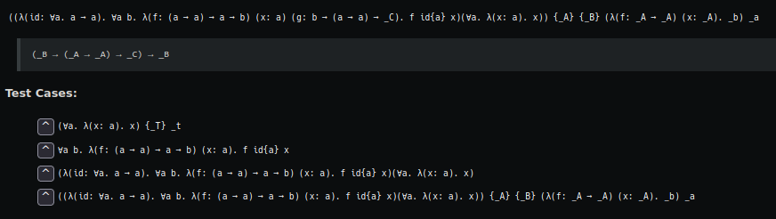
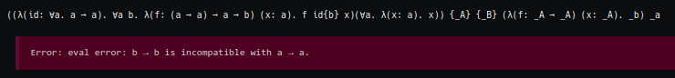

# reactivity

Currently, this is a small System Fω implementaion in functional-ish typescript. The parsing is pretty cool. I will be extending it to add syntax sugar and dependent types.





> Note: the screenshots are using Dark Reader. I'll add dark styles sooner or later.

## using

To install dependencies:

```bash
bun install
```

To run:

```bash
bun run build.ts
```

This project was created using `bun init` in bun v0.6.14. [Bun](https://bun.sh) is a fast all-in-one JavaScript runtime.
